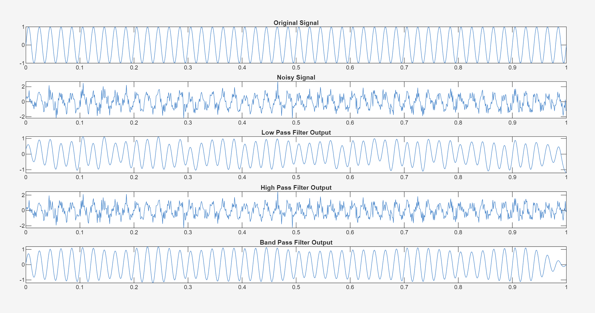
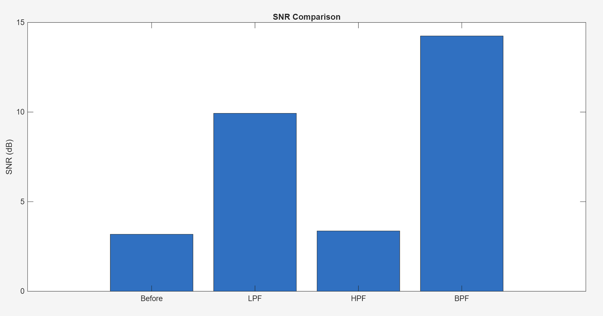
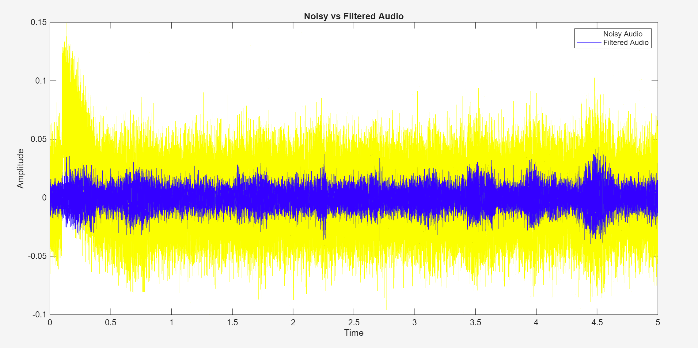
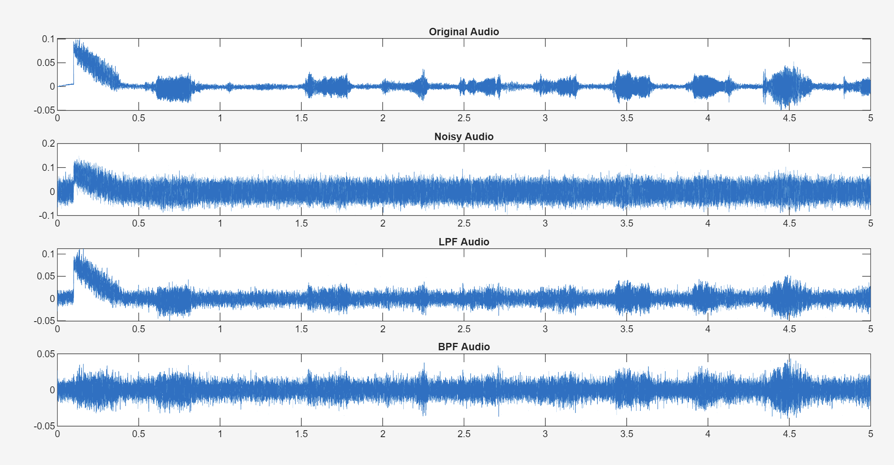
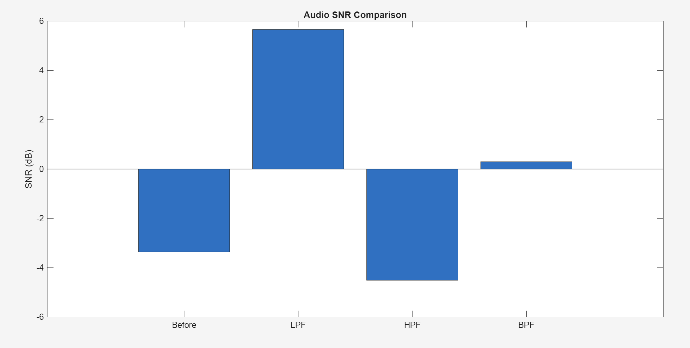
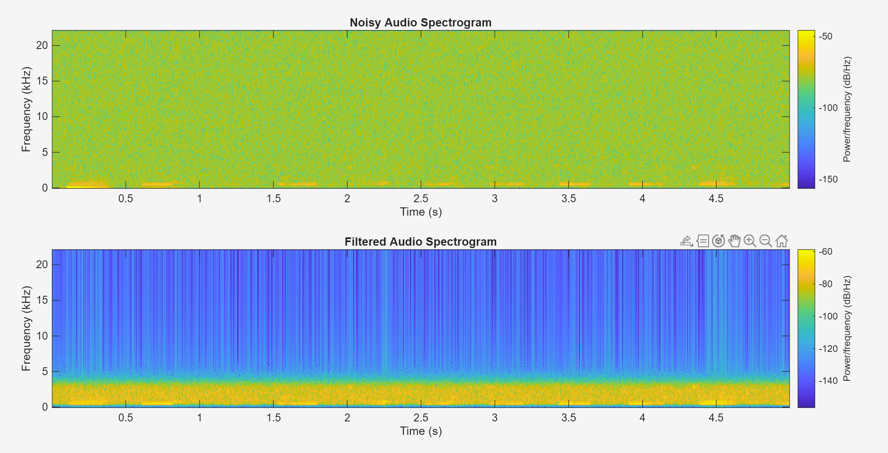

SMART SIGNAL FILTERING AND NOISE REDUCTION(MATLAB)

OVERVIEW

This project focuses on removing noise from signals using basic digital filters in MATLAB. Both a generated signal and a real audio signal are used to understand how filtering works in practice.

WHAT IS DONE
* Created a noisy signal
* Applied Low Pass, High Pass and Band Pass filters
* Compared performance using SNR (Signal-to-Noise Ratio)
* Applied the same filters on a real audio recording
* Visualized results using plots and spectrogram

OBSERVATIONS
* Low Pass Filter removes high frequency noise
* High Pass Filter removes useful signal components, so performance is poor
* Band Pass Filter gives the best result for real-world signals

AUDIO ANALYSIS

A short audio recording was used and noise was added.

After applying filters:
* Noise reduction can be seen in time-domain plots
* Spectrogram shows reduction in noise energy after filtering
  
APPLICATIONS
* Audio noise reduction
* Communication systems
* Signal processing in sensors
* Basic DSP understanding

CONCLUSION

Filtering improves signal quality, and choosing the correct filter is important. Band Pass filtering works best for signals where the frequency range is known.

This project was implemented using MATLAB.

RESULTS

Signal Processing

A simple signal is generated and noise is added to it. Different filters are then applied to observe how effectively the noise can be reduced.

 Signal SNR Comparison

This graph shows the improvement in Signal-to-Noise Ratio (SNR) after applying different filters to the signal.

 Noisy vs Filtered (Overlay)

This plot compares the noisy signal (yellow) with the filtered signal (blue), clearly showing the reduction in noise.

Audio Signal Processing

The same filtering techniques are applied to a recorded audio signal. The plots show how the audio waveform changes after filtering.

 Audio SNR Comparison

This graph compares the SNR of the audio signal before and after applying different filters.

 Audio Spectrogram Analysis

The spectrograms show the frequency content of the audio before and after filtering. The filtered signal shows reduced noise components.

